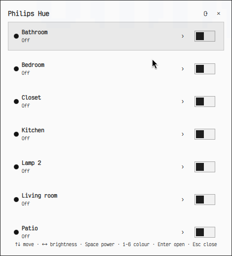
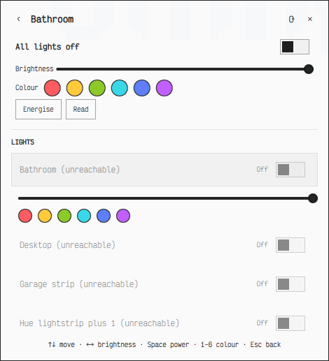

# Philips Hue for Omarchy

A [Philips Hue](https://www.philips-hue.com/) control plugin for the
[Omarchy](https://omarchy.org/) shell (Quickshell). Opens as a floating
desktop window — not a bar dropdown — with room and per-light control, and
is fully keyboard-navigable.

<p align="center">
  
  
</p>

## Features

- **Floating window**, not a bar popover — click the `HUE` bar button or use
  a keybinding, both open the same normal desktop window.
- **Per-room control** — power, brightness, colour, and scenes for a whole
  room.
- **Per-light control** — drill into a room to power, dim, and colour each
  bulb individually, not just the room as a whole.
- **Fully keyboard-native** — `↑↓`/`jk` to navigate, `←→`/`hl` to nudge
  brightness, `Space` to toggle power, `1`–`6` to apply a colour, `Enter` to
  open a room, `Esc` to back out/close. No mouse required. See
  [Keyboard reference](#keyboard-reference).
- **Ambient mode** — sync a room's colour to what's on screen and pulse its
  brightness with system audio. See [Ambient mode](#ambient-mode).
- **Light show** — pick 4-6 colours and set a room dancing through them,
  each light cycling independently and speeding up with the music. See
  [Light show](#light-show).
- **No cloud, no account.** Talks directly to your bridge on the local
  network over the Hue v1 local API. Nothing leaves your LAN.
- **Zero dependencies** — the backend is a single dependency-free Python 3
  script using only the standard library. (Ambient mode shells out to a few
  system binaries — see [Ambient mode](#ambient-mode) — the same way
  discovery already shells out to `avahi-browse`; no new Python packages.)

## Requirements

- [Omarchy](https://omarchy.org/) with the Quickshell-based shell
  (`omarchy-shell`).
- Python 3 (already present on any Omarchy install).
- A Philips Hue Bridge on the same local network.

## Install

```bash
git clone https://github.com/sasukevibes/omarchy-hue.git ~/.config/omarchy/plugins/ashton.hue
omarchy-shell shell rescanPlugins
```

> The plugin directory name (`ashton.hue`) doubles as its Omarchy plugin id.
> If you rename the folder, update the `id` in `manifest.json` and every
> `moduleName`/`ipcTarget`/`IpcHandler target` string in the `.qml` files to
> match, or the widget won't register correctly.

Add the `HUE` widget to your bar with `omarchy bar move ashton.hue --section
right` (or edit `~/.config/omarchy/shell.json` directly), then add a
keybinding in `~/.config/hypr/bindings.lua`:

```lua
o.bind("SUPER + SHIFT + H", "Philips Hue", "omarchy-shell ashton.hue toggle")
```

## First run — pairing

1. Open the widget (bar button or keybinding). It searches the local network
   for a bridge via mDNS, SSDP, and the Hue discovery endpoint.
2. Press the physical link button on top of your Hue Bridge.
3. Click **Pair with `<bridge name>`** in the window within about 30 seconds.

The bridge issues a local API token on pairing, stored at
`~/.local/state/omarchy/hue.json` with owner-only (`0600`) permissions. This
token is the credential that controls your lights — see
[SECURITY.md](SECURITY.md) before sharing logs, screen recordings, or that
file with anyone.

## Keyboard reference

| Key | Action |
|---|---|
| `↑`/`↓` or `j`/`k` | Move the cursor between rooms, or between lights inside a room |
| `←`/`→` or `h`/`l` | Nudge brightness of whatever's focused, ~10% per press |
| `Space` | Toggle power of whatever's focused |
| `1`–`6` | Apply that colour swatch to whatever's focused |
| `Enter` | Open the focused room |
| `Esc` | Step back a level, then close the window |
| `r` | Refresh |

Moving the cursor onto a light auto-reveals its own brightness/colour
controls — no extra keypress needed to see or adjust it.

## Ambient mode

Open a room and flip **Ambient mode** on: the room's colour follows an
average of what's on your screen, and its brightness pulses a little with
whatever your system is playing. Only one room can run ambient mode at a
time — starting it in a different room stops the previous one.

- **Sync from** picks which output(s) feed the colour: **All monitors**
  blends every active display, or pick one by name (as reported by
  `hyprctl monitors`) to follow just that screen — useful if only one
  display is showing the thing you want reflected.
- It pauses automatically while the screen is locked (`hyprlock`), and if a
  chosen monitor disconnects mid-session it retries rather than crashing.
- It keeps running after you close the widget window — turn it off from the
  room's toggle (or `python3 hue.py ambient-stop`) when you're done.
- If `pw-record`/`pactl` aren't installed, no default output device can be
  resolved, or **your default output is a Bluetooth device**, the audio
  pulse is simply absent — colour sync still works from screen content
  alone. See [How it works](#how-it-works) for why Bluetooth output is
  excluded.
- Colour/brightness are only pushed to the bridge a few times a second, with
  small changes coalesced, to stay well under the Hue bridge's request-rate
  limit.
- **Turn an individual light off to drop it out of the sync.** Ambient mode
  normally drives the whole room with one action, so a light you turn off
  by hand would otherwise be flipped straight back on by the next tick.
  Instead, turning a light off while ambient mode is running excludes just
  that light until you turn it back on (via its power toggle, or any
  brightness/colour change) — it rejoins immediately, not on the next
  incidental screen-colour change.

Requires `grim` and `hyprctl` (both standard on an Omarchy/Hyprland
install) for screen capture and monitor listing, and optionally `pw-record`
and `pactl` (both part of PipeWire) for the audio pulse, and `pgrep` for
lock-screen detection.

## Light show

Open a room, tap 4 to 6 of the colour swatches to build a palette, then hit
**Start light show**. Each light in the room cycles independently through
your chosen colours on its own staggered timer, so the room is always
mid-transition somewhere rather than flipping as one flat block.

- Loud music speeds the cycle up (as fast as ~2s between changes per light)
  and brightens the peaks; quiet or no audio settles into a slower ~6s
  cycle at a gentler brightness. Same Bluetooth-safe audio tap as ambient
  mode — see [Ambient mode](#ambient-mode) for why Bluetooth output is
  skipped.
- Only one dynamic mode runs at a time: starting a light show stops ambient
  mode (in any room), and vice versa.
- Click swatches while a show is running to change the palette live — it
  restarts with the new colours immediately, no need to stop first.
- Turning an individual light off during a show pauses just that light —
  same per-light exclusion as ambient mode. It stays off until you turn it
  back on, then rejoins the cycle (immediately advancing if its next
  scheduled colour change came due while it was paused).

## How it works

- `hue.py` is a small, dependency-free Python 3 client for the Hue Bridge
  [v1 local API](https://developers.meethue.com/develop/hue-api/). It's
  invoked as a subprocess by the QML UI and talks JSON over stdout.
- Ambient mode forks a detached background process from `hue.py` (so it
  survives the widget window closing), tracked by a small state file at
  `~/.local/state/omarchy/hue-ambient.json`. It samples the screen with
  `grim`, reads system audio via `pw-record` explicitly targeted at
  `pactl get-default-sink`'s `.monitor` node, and never writes screen or
  audio content to disk — only the resulting colour/brightness numbers ever
  leave the process, as bridge API calls.
- The audio pulse deliberately skips Bluetooth output devices entirely.
  `pw-record` is explicitly targeted at the default sink's *monitor*, never
  its microphone — left to its default it would fall back to PipeWire's
  default *source*, which on a Bluetooth headset is the mic, and opening
  that forces the headset onto the low-quality bidirectional HSP/HFP call
  profile. But testing found that even the monitor-only tap still triggers
  the same profile renegotiation on at least some Bluetooth stacks/devices
  — PipeWire/WirePlumber appears to treat *any* capture stream linked to a
  Bluetooth card as a reason to prefer a profile with microphone support,
  regardless of what that stream actually targets. There's no known way to
  safely tap a Bluetooth sink's monitor from here, so `hue.py` checks
  whether the default sink name starts with `bluez_` and, if so, skips
  audio capture altogether — ambient mode still runs, just without the
  audio-driven brightness pulse, on wired/analog/HDMI/USB output only.
- `manifest.json`, `BarWidget.qml`, `Panel.qml`, and `HueControls.qml` are the
  Omarchy/Quickshell plugin — see the
  [Omarchy plugin docs](https://omarchy.org/) for the shell plugin model.

## Security

This plugin controls hardware on your home network and stores a bridge
credential on disk. Please read [SECURITY.md](SECURITY.md) for the threat
model, known limitations inherent to the Hue v1 API, and how to report a
vulnerability — **before** filing a bug report that might include your
`hue.json` contents.

## Contributing

PRs are welcome — see [CONTRIBUTING.md](CONTRIBUTING.md). All contributions
go through pull requests with required review; nothing merges to `main`
without an approval.

## License

[MIT](LICENSE)
